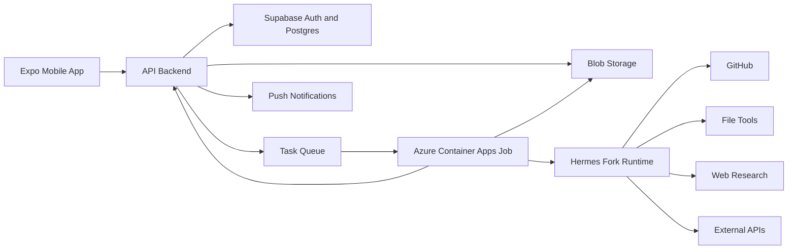
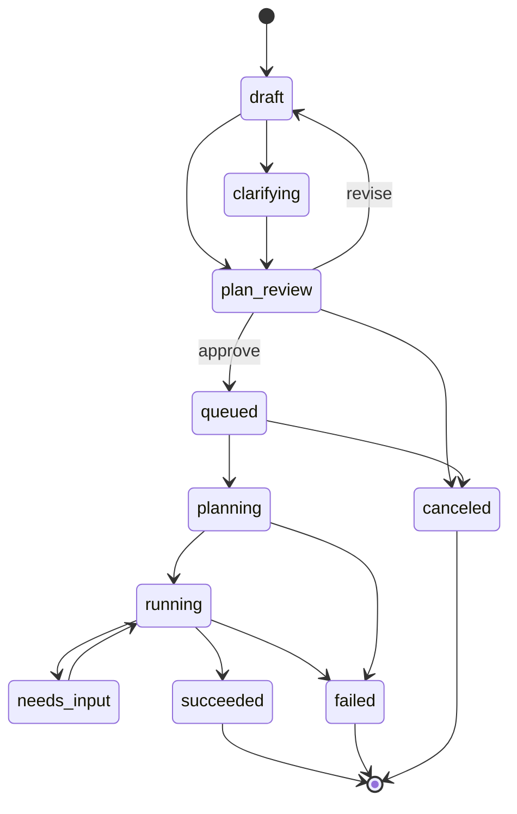

# Raincloud Architecture

Date: 2026-04-30
Status: MVP architecture foundation

## Goal

Raincloud needs a simple architecture that proves the core loop:

1. Mobile user submits a task.
2. Raincloud clarifies and plans the task.
3. User approves the plan.
4. Cloud worker runs the task.
5. User receives a result artifact or blocker notification.

The system should be cheap, understandable, and hackathon-buildable. It should avoid persistent compute and broad account permissions until the product proves demand.

## System Diagram

## Components

### Expo Mobile App

Responsibilities:

- Sign in.
- Create tasks from natural language.
- Upload files.
- Connect/select GitHub repository.
- Answer clarifying questions.
- Review plan.
- Approve or cancel job.
- Watch status.
- Receive push notification.
- Open result artifacts or PR links.

### API Backend

Responsibilities:

- Own task lifecycle.
- Generate or coordinate lightweight plans.
- Store approved plan snapshots.
- Estimate credits and runtime.
- Enforce limits.
- Queue approved jobs.
- Receive worker milestones.
- Send push notifications.
- Expose task and artifact metadata to the app.

### Supabase Auth And Postgres

Responsibilities:

- User authentication.
- User records.
- Task metadata.
- Plan records.
- Approval events.
- Worker run status.
- Artifact metadata.
- Usage accounting.

### Blob Storage

Responsibilities:

- User uploads.
- Generated artifacts.
- Exported reports.
- Audio/video outputs.
- Temporary worker handoff files.

Artifacts should have short default retention in v1 unless the user downloads or explicitly saves them.

### Task Queue

Responsibilities:

- Decouple plan approval from worker startup.
- Allow retry and failure handling.
- Prevent the API from holding long-running requests.
- Provide backpressure for expensive jobs.

### Azure Container Apps Jobs

Responsibilities:

- Run approved tasks as finite cloud jobs.
- Start only after explicit user approval.
- Receive task payload and scoped credentials.
- Upload artifacts.
- Shut down after completion or failure.

### Hermes Fork Runtime

Responsibilities:

- Execute agentic portions of approved plans.
- Use task-specific tools.
- Coordinate substeps.
- Produce milestones.
- Return final summary and artifacts.

Hermes is a runtime substrate, not the whole product. Raincloud owns planning, approval, task limits, mobile UX, billing credits, artifact handling, and notifications.

### External APIs

Responsibilities:

- Audio generation.
- Video processing when cheaper than direct compute.
- Web search.
- Document extraction.
- Fine-tuning or model tasks when useful.

External API usage must be shown in the preflight plan and capped before execution.

## Task Lifecycle

## Planning Contract

Before a worker starts, Raincloud must create an approved plan with:

- Clarified goal.
- Inputs.
- Required permissions.
- Recipe or runtime choice.
- Execution steps.
- Expected artifacts.
- Runtime estimate.
- Credit estimate.
- External API usage.
- Limits.
- Assumptions.
- Risks.

The approved plan is immutable for that worker run. If the user changes the task, Raincloud creates a new plan revision and requires approval again.

## Data Records

Minimum conceptual records:

- `users`
- `tasks`
- `task_plans`
- `clarifying_questions`
- `approvals`
- `attachments`
- `worker_runs`
- `milestones`
- `artifacts`
- `usage_records`

No final database schema is required yet, but implementation should keep these boundaries intact.

## Security And Isolation

MVP defaults:

- One ephemeral worker per approved task.
- No persistent memory.
- No shared workspace between users.
- No broad credential vault.
- Narrow GitHub repo permissions.
- Signed or expiring artifact URLs.
- Redacted logs.
- Runtime and spend caps.

The worker should receive only the files, credentials, and plan required for that task.

## Cost Controls

Controls:

- Plan-phase estimate before approval.
- Per-task credit cap.
- Max runtime.
- Max upload size.
- Max artifact size.
- Max generated audio minutes.
- Max video duration.
- Max retries.
- External API spend cap.

Jobs that exceed caps should fail with an explanation before doing expensive work where possible.

## Observability

Hackathon-grade observability should include:

- Task status history.
- Worker run start/end timestamps.
- Runtime duration.
- Model/API usage estimate.
- Artifact sizes.
- Failure reason.
- User-visible compact logs.

Raw logs can exist internally during development, but the user-facing product should summarize them.
