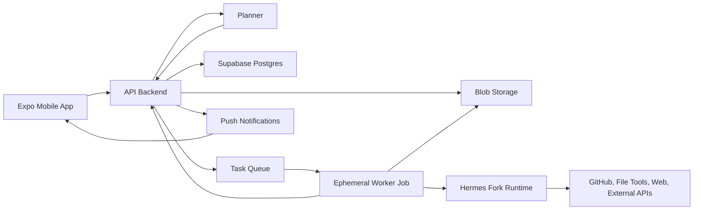
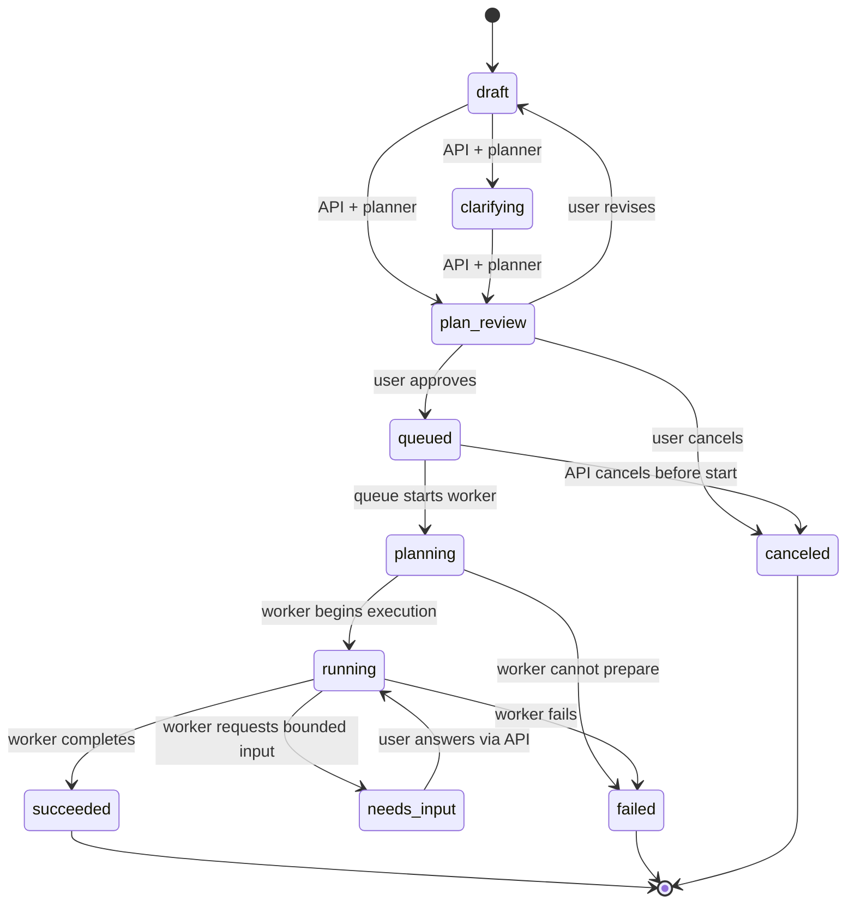

# Runtime Architecture

Date: 2026-05-01
Status: MVP boundary guide

## Purpose

Raincloud separates the phone experience, API control plane, planning system, and worker runtime so every expensive or permissioned action happens only after a user approves a bounded plan.

This document defines those runtime boundaries. It does not define final code modules, database schema, cloud resources, or implementation details.

## Boundary Principles

- The mobile app is the user control surface, not a runtime host.
- The API backend is the system of record for task state, approvals, limits, and artifact metadata.
- The planner creates a preflight contract before execution. It must not run heavyweight work.
- The worker executes only an approved plan snapshot. It must not reinterpret the original prompt into a broader job.
- Each worker run is finite, isolated, and scoped to one approved task.
- Every cross-boundary handoff should be serializable, auditable, and safe to replay or inspect.

## Runtime Overview

The API owns orchestration. The planner and worker are subordinate runtimes with narrower mandates.

## Component Boundaries

| Component | Owns | Must Not Own |
| --- | --- | --- |
| Mobile app | Task entry, attachments UI, clarification answers, plan review, approval/cancel actions, status/result views, push notification handling | Worker execution, secret handling beyond local auth session, final task state, direct queue writes, direct artifact mutation |
| API backend | Task lifecycle, authorization, plan orchestration, approval records, queueing, worker run records, usage accounting, artifact metadata, notifications | Long-running task execution, mobile-only state, unapproved heavy processing, broad external account automation |
| Planner | Clarifying questions, task classification, recipe/runtime recommendation, permission list, execution steps, limits, estimates, assumptions, risks | Starting workers, mutating artifacts, cloning repos, processing full media files, spending against external APIs beyond lightweight estimation |
| Worker job | Approved task execution, scoped tool calls, milestone reports, artifact uploads, usage reports, final success/failure summary | Changing the approved plan scope, asking for broad new permissions, owning user identity, storing persistent memory, directly notifying the user |
| Hermes fork runtime | Agentic execution inside the worker, tool coordination, substep reasoning, result synthesis | Raincloud product policy, billing policy, approval policy, task state authority, artifact retention policy |

## Task Lifecycle Ownership

The API is the only component that can change canonical task state. The planner proposes plans; the worker reports run events; the mobile app requests transitions through authenticated API calls.

The `planning` lifecycle state means worker-side preparation after approval, such as validating scoped inputs or setting up the runtime. It is distinct from the preflight planner that creates the user-approved plan.

## Cross-Boundary Contracts

These are conceptual contracts, not final schemas.

### Task Draft

Created by the mobile app through the API.

- User intent.
- User-visible title if known.
- Attachments, links, or repository selections.
- User preferences.
- Current draft instructions.

The draft can change until a plan is approved.

### Planner Request

Created by the API for the planner.

- Task draft snapshot.
- User answers to clarifying questions.
- Available input metadata.
- Allowed task lanes or recipes.
- Account and permission metadata needed for planning.
- Product limits and pricing rules.

The planner request should avoid handing over raw secrets. Metadata should be enough for preflight decisions.

### Proposed Plan

Created by the planner and stored by the API.

- Clarified goal.
- Selected task lane or recipe.
- Required inputs.
- Required permissions.
- Execution steps.
- Expected artifacts.
- Runtime estimate.
- Credit or cost estimate.
- External API usage estimate.
- Limits.
- Assumptions.
- Risks.
- Blocking questions, if any.

The proposed plan is user-reviewable. It is not executable until approved.

### Approved Plan Snapshot

Created by the API when the user approves.

- Immutable plan contents.
- Approval event.
- Approving user.
- Approval timestamp.
- Effective limits.
- Version or revision identifier.

The approved snapshot is the worker's authority. Later user edits require a new plan revision and approval.

### Worker Run Payload

Created by the API after approval and delivered through the queue.

- Approved plan snapshot reference or embedded snapshot.
- Scoped input file references.
- Scoped credentials or exchange tokens.
- Runtime limits.
- Spend caps.
- Artifact destination.
- Milestone callback target.
- Cancellation or heartbeat instructions.

The payload must be sufficient for execution without asking the worker to infer a broader product policy.

### Worker Events

Sent from the worker to the API.

- Run started.
- Milestone reached.
- Usage reported.
- Bounded input requested.
- Artifact uploaded.
- Failure reported.
- Run completed.

Worker events are append-only observations. The API translates them into canonical task state.

### Artifact Metadata

Created by the API from worker reports and storage results.

- Artifact type.
- Display name.
- Storage key or external URL.
- Size and checksum where available.
- Retention policy.
- Visibility.
- Related worker run.

The mobile app reads artifact metadata from the API and receives signed or expiring access URLs when needed.

## Planning Boundary

The planner may:

- Ask clarifying questions.
- Choose a task lane or recipe.
- Estimate cost and runtime.
- Identify required permissions.
- Decide whether a request is too vague, unsafe, unsupported, or too expensive.
- Produce a proposed plan for mobile review.

The planner must not:

- Launch a worker.
- Queue a job.
- Spend material external API credits.
- Clone or mutate a repository.
- Process full media or datasets.
- Upload final artifacts.
- Mark a task as complete.

If planning needs lightweight inspection, the API must expose explicit, capped helpers such as file metadata extraction, repository metadata lookup, or small sample previews.

## Worker Boundary

The worker may:

- Execute the approved steps.
- Use the tools and credentials named in the approved plan.
- Report milestones and usage.
- Upload artifacts.
- Request bounded user input when blocked.
- Return a useful failure summary.

The worker must not:

- Expand scope beyond the approved plan.
- Persist user data after the run.
- Reuse credentials across tasks.
- Contact the user directly.
- Modify canonical task or billing records directly.
- Continue after runtime, spend, or artifact caps are exceeded.

When the worker discovers the approved plan is insufficient, it should stop or request bounded input instead of silently broadening execution.

## Mobile Boundary

The mobile app may cache display data for responsiveness, but the API remains authoritative.

Mobile responsibilities:

- Draft and revise task instructions.
- Upload or select inputs through API-authorized flows.
- Display clarifying questions.
- Display proposed plans.
- Capture approval, revision, or cancellation.
- Display milestones, blockers, results, and artifacts.

Mobile should not expose raw worker logs by default. The product promise is asynchronous delegation, so the default result surface should be concise, artifact-centered, and readable on a phone.

## API Boundary

The API is the control plane.

API responsibilities:

- Authenticate users.
- Authorize access to tasks, attachments, plans, runs, and artifacts.
- Store the canonical task lifecycle.
- Coordinate the planner.
- Store plan revisions and approvals.
- Enforce limits before queueing.
- Create queue messages for approved runs.
- Accept worker events.
- Translate worker events into task state.
- Issue signed artifact URLs.
- Send push notifications.
- Record usage and spend.

The API should be boring and strict. If a boundary is unclear, the API owns the policy decision and the worker receives a narrower instruction.

## Data Ownership

| Record | Authoritative Owner | Writers | Readers |
| --- | --- | --- | --- |
| User | API and auth provider | API/auth provider | Mobile, API |
| Task | API | API | Mobile, planner, worker through scoped payload |
| Task draft | API | Mobile through API | Mobile, planner |
| Clarifying question | API | Planner through API | Mobile |
| Plan revision | API | Planner through API | Mobile, worker after approval |
| Approval event | API | Mobile through API | Mobile, worker after approval |
| Worker run | API | API, worker events | Mobile, API |
| Milestone | API | Worker through API | Mobile |
| Artifact metadata | API | API from worker reports | Mobile |
| Artifact bytes | Blob storage | Mobile uploads, worker uploads | Mobile through signed URLs, worker through scoped references |
| Usage record | API | Worker through API, API estimates | Mobile summary, billing/admin views |

## Failure And Input Handling

Workers can fail usefully. A failure is acceptable when it is bounded, explained, and reflected in the task detail view.

Failure summaries should include:

- What was attempted.
- Where execution stopped.
- Whether partial artifacts exist.
- Whether user action can unblock the task.
- Actual usage or credits spent.
- Suggested next step.

When a worker needs user input, it should request a specific answer within the approved scope. Broad replanning should return the task to plan review with a new revision.

## Security And Cost Guardrails

- No worker starts before approval.
- Worker credentials are scoped to one task and one run.
- Artifact links expire unless explicitly saved.
- Logs and milestones redact secrets and sensitive file contents.
- Runtime, spend, upload, artifact, and retry caps are enforced by the API and repeated in the worker payload.
- External API usage appears in the proposed plan before approval.
- User-facing status never depends on direct worker-to-mobile communication.

## Implementation Guidance

Early implementation should keep these boundaries visible even if the first version is small:

- Use explicit task states instead of ad hoc booleans.
- Store approved plan snapshots before queueing.
- Treat worker callbacks as events, not direct state mutations.
- Keep planner helpers cheap and capped.
- Prefer one worker run per approved plan.
- Make artifact metadata readable before optimizing storage internals.

The MVP can start with simple infrastructure, but the runtime shape should preserve the control-plane/execution-plane split from the beginning.
