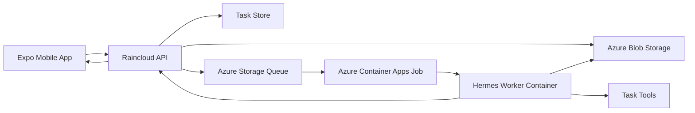

# Hermes Cloud Orchestration Proposal

Date: 2026-05-01
Status: Proposed for MVP implementation

## Purpose

Raincloud needs the smallest cloud architecture that proves its core product loop:

1. A user submits a task from mobile.
2. Raincloud asks clarifying questions and creates a reviewable plan.
3. The user approves the plan.
4. The API dispatches one bounded cloud run.
5. Hermes runs inside Azure and calls task tools as needed.
6. The user receives a returned artifact or a useful failure.

The first acceptance task is PDF merge, but the architecture should not be PDF-specific. PDF merge is the initial proof case for file upload, preflight clarification, approved dispatch, worker execution, artifact upload, and result retrieval.

## Recommended MVP Architecture

Use Azure Container Apps Jobs for finite Hermes worker runs, Azure Storage for queue and blob handoff, and a small API backend as the control plane.



The API is responsible for task state, authorization, plan approval, queueing, and artifact metadata. The worker receives only an approved plan payload and scoped file references. Hermes is the execution runtime inside the worker, not the owner of Raincloud product policy.

## Implementation Target

The follow-up implementation should add four deployable or shared surfaces:

- `apps/api`: the Raincloud control-plane service.
- `apps/worker`: the Hermes worker adapter and task tool host.
- `packages/domain`: shared task, plan, payload, event, and artifact contracts.
- `infra/azure`: scripts or templates for the Azure Storage, Container Registry, Container Apps, and secret configuration.

The first version can keep the API and worker intentionally small. The important architectural boundary is that the API owns state and approval, while the worker owns one finite execution attempt.

## Components

### Mobile App

The mobile app remains the user control surface. For MVP cloud dispatch it must support:

- Task creation.
- File attachment upload through the API.
- Clarifying answer submission.
- Plan review.
- Approval.
- Status/result display.

For the first acceptance task, the app should let the user upload PDFs and answer natural-language reorder requests such as "put Q3 before Q2." The app should not directly decide execution order; it sends answers to the API/planner and displays the resolved order before approval.

### Raincloud API

The API is the control plane. It should be implemented as a small backend service that can be deployed independently from the mobile app.

Responsibilities:

- Create and update task drafts.
- Accept file uploads and store originals in Azure Blob Storage.
- Store attachment metadata.
- Ask or coordinate clarifying questions.
- Convert answers into a proposed plan.
- Require explicit approval before dispatch.
- Store the approved plan snapshot.
- Enqueue one worker payload per approved plan.
- Track worker run state.
- Accept signed worker callbacks.
- Store artifact metadata.
- Return signed artifact URLs to the mobile app.

For the MVP, the task store can be simple as long as the boundary is preserved. A local JSON store is acceptable only for a smoke-test prototype. The first durable implementation should use Supabase Postgres or another real database so task state survives API restarts.

### Azure Storage

Azure Storage should provide the first queue and artifact handoff.

Blob containers:

- `inputs`: original uploaded files.
- `outputs`: generated artifacts.
- `worker-temp`: optional short-lived worker scratch handoff.

Queue:

- `approved-worker-runs`: one message per approved worker run.

The queue message should not contain raw file bytes or broad secrets. It should contain references, IDs, limits, and the approved plan snapshot or a pointer to it.

### Azure Container Apps Job

The worker should run as an Azure Container Apps Job, not a persistent server.

Responsibilities:

- Start from an approved queue message.
- Download only scoped input blobs.
- Run Hermes with the approved worker payload.
- Call local deterministic tools when Hermes selects them.
- Upload generated artifacts.
- Report milestones and final status to the API.
- Exit after success, failure, cancellation, or timeout.

The job should have runtime and retry caps. The first deployment can use a single worker replica with conservative CPU and memory settings.

### Hermes Worker Container

The worker image contains:

- Hermes runtime entrypoint.
- Raincloud worker adapter.
- Task tool registry.
- Azure Blob client.
- API callback client.
- Minimal validation and redaction helpers.

Hermes receives an approved payload and can call tools, but it must not reinterpret the task into a broader scope. If the approved plan is insufficient, the worker should fail usefully or request bounded input through the API.

### Task Tools

Task tools are deterministic functions exposed to Hermes. The first tool should be a PDF merge tool because it proves artifact production without requiring external account credentials.

Tool contract shape:

- Input: ordered scoped file references and output options.
- Output: artifact path, metadata, summary, and warnings.
- Failure: typed error with user-safe message and optional internal diagnostic.

## Worker Payload

The API should enqueue a payload with this conceptual shape:

```json
{
  "runId": "run_123",
  "taskId": "task_123",
  "approvedPlanId": "plan_123",
  "approvedPlan": {
    "lane": "pdf_merge",
    "goal": "Merge the approved PDFs into one returned PDF.",
    "steps": ["Validate inputs", "Merge PDFs in approved order", "Upload merged PDF"],
    "expectedArtifacts": ["merged.pdf"],
    "limits": {
      "maxInputFiles": 7,
      "maxRuntimeSeconds": 300
    }
  },
  "inputs": [
    {
      "attachmentId": "att_cover",
      "blobKey": "inputs/task_123/cover.pdf",
      "displayName": "Cover.pdf",
      "mimeType": "application/pdf"
    }
  ],
  "artifactDestination": {
    "container": "outputs",
    "prefix": "outputs/task_123/run_123/"
  },
  "callback": {
    "url": "https://api.example.com/internal/worker-runs/run_123/events",
    "secretRef": "RAINCLOUD_WORKER_CALLBACK_SECRET"
  }
}
```

The exact schema can evolve, but the payload must preserve these properties:

- It is created only after approval.
- It identifies one task and one worker run.
- It contains the approved plan authority.
- It uses scoped file references.
- It repeats execution limits.
- It includes a callback target for append-only worker events.
- It references callback credentials by environment variable key only.
- It never serializes raw secrets into the Storage Queue message.

In the sample payload, `callback.secretRef` is the name of a secret-backed environment variable available inside the worker container. The worker resolves that environment variable locally when signing callback requests. The raw callback secret must be stored in the worker environment or secret store, not in the queue message.

## Worker Events

The worker should report append-only events to the API:

- `run_started`
- `milestone`
- `artifact_uploaded`
- `usage_reported`
- `input_requested`
- `run_succeeded`
- `run_failed`

The API translates these events into canonical task and worker run state. The worker does not directly own user-visible status outside its event reports.

## Queue Delivery And Idempotency

Azure Storage Queue delivery must be treated as at least once. A worker run can be delivered more than once if a job crashes, is cancelled, or exceeds the message visibility timeout before deletion.

MVP idempotency rules:

- The API is the idempotency authority for `runId`.
- Before downloading inputs, calling Hermes, uploading artifacts, or recording billable usage, the worker must claim the run through the API.
- The API claim operation must atomically transition `queued` to `running` for that `runId`.
- If the run is already `running` or terminal, the API returns the current state and the duplicate worker exits without side effects.
- Artifact destinations are deterministic per run, such as `outputs/{taskId}/{runId}/merged.pdf`, so retries cannot create extra user-visible artifacts.
- Final callbacks are idempotent: the API accepts the first valid terminal event and ignores later terminal events for the same `runId`.
- The worker deletes the queue message only after the API accepts `run_succeeded` or `run_failed`, or after the API confirms the message is a duplicate for an already running or terminal run.

This makes duplicate delivery safe. A second worker can receive the same approved payload, but it cannot produce another artifact, advance state, or record additional usage unless it first wins the API claim.

## Required Azure Resources

For the first deployed loop:

- Resource group.
- Azure Container Registry.
- Azure Container Apps environment.
- Azure Container Apps Job for the Hermes worker.
- Azure Storage account.
- Blob containers for inputs and outputs.
- Storage queue for approved worker runs.
- Managed identity or service principal with narrow storage permissions.
- API hosting target, preferably Azure Container Apps for consistency.

Optional but recommended soon after the first loop:

- Supabase project for auth and Postgres.
- Application Insights or Log Analytics.
- Key Vault for secrets.
- Custom domain for the API.

## Required Configuration

Development and deployment need these values, stored locally in `.env` and remotely as GitHub or Azure secrets:

- `AZURE_SUBSCRIPTION_ID`
- `AZURE_TENANT_ID`
- `AZURE_CLIENT_ID`
- `AZURE_CLIENT_SECRET`
- `AZURE_RESOURCE_GROUP`
- `AZURE_LOCATION`
- `AZURE_CONTAINER_REGISTRY_NAME`
- `AZURE_CONTAINER_APPS_ENVIRONMENT_NAME`
- `AZURE_HERMES_JOB_NAME`
- `AZURE_STORAGE_ACCOUNT_NAME`
- `AZURE_STORAGE_QUEUE_NAME`
- `AZURE_INPUTS_CONTAINER_NAME`
- `AZURE_OUTPUTS_CONTAINER_NAME`
- `RAINCLOUD_API_URL`
- `RAINCLOUD_WORKER_CALLBACK_SECRET`
- Hermes model provider key, such as `OPENAI_API_KEY`, if the runtime needs one

The MVP should prefer managed identity for Azure resource access once deployed. Connection strings are acceptable for local smoke testing only.

## First Acceptance Task: PDF Merge

PDF merge is the first end-to-end cloud test case.

Requirements:

- User uploads up to 7 PDFs.
- Raincloud asks clarifying questions instead of immediately dispatching.
- User can request ordering changes in natural language.
- Planner resolves the request into an ordered attachment list.
- Ambiguous ordering causes another clarifying question.
- Plan review shows the final PDF order and output filename before approval.
- API dispatches only after approval.
- Hermes worker calls the PDF merge tool with the approved order.
- Worker uploads one merged PDF artifact.
- Mobile/API returns a signed URL for the merged PDF.
- Corrupt, encrypted, missing, or non-PDF inputs fail with a user-safe explanation.

This test case proves the orchestration architecture while keeping the first tool deterministic and easy to validate.

## Implementation Phases

### Phase 1: Local Contract Loop

- Define task, attachment, plan, worker payload, event, and artifact contracts.
- Add a local PDF merge tool and fixtures.
- Run the worker locally from a saved approved payload.
- Produce a merged PDF in local output storage.

### Phase 2: Azure Handoff

- Provision Azure Storage containers and queue.
- Build the Hermes worker container.
- Push image to Azure Container Registry.
- Configure Azure Container Apps Job.
- Enqueue an approved payload and confirm the job starts.
- Upload a merged PDF artifact to Blob Storage.

### Phase 3: API-Controlled Dispatch

- Add the API backend.
- Add upload, task draft, clarifying answer, plan review, approval, and status endpoints.
- Have approval enqueue the worker payload.
- Accept worker callbacks.
- Return artifact metadata and signed URLs.

### Phase 4: Mobile Integration

- Connect mobile task flow to the API.
- Support PDF upload and ordering clarification.
- Show plan review and approval.
- Show worker status and returned PDF.

## Testing And Verification

Architecture-level checks:

- A worker run cannot be enqueued before approval.
- The worker payload uses approved attachment IDs and does not accept arbitrary paths.
- Worker callbacks require the shared callback secret.
- Worker events are append-only.
- Runtime and file-count limits are enforced in the API and worker.

PDF acceptance checks:

- Merge tool produces one PDF from fixture inputs in the approved order.
- Natural-language reorder instructions resolve to the expected order.
- Ambiguous reorder instructions produce a clarifying question.
- Invalid PDFs fail with a clear failure event.
- The final artifact is uploaded and returned through API metadata.

Deployment smoke checks:

- API can upload a file to Blob Storage.
- API can enqueue a worker payload.
- Azure Container Apps Job starts from the queue.
- Worker can download scoped inputs.
- Worker can upload an output artifact.
- Worker can post a final callback to the API.

## Non-Goals

- Persistent per-user cloud machines.
- Multi-cloud portability.
- Production billing.
- Push notifications for the first proof.
- GitHub PR automation.
- OCR, compression, page editing, rotation, or watermarking in the first PDF task.
- Broad credential vaulting.

## Open Decisions

- Whether the first durable task store is Supabase Postgres or a minimal API-owned database.
- Whether the planner for natural-language reorder is initially model-backed or a constrained rule-based parser with model fallback.
- Whether the first Azure smoke test uses a queue-triggered Container Apps Job immediately or temporarily starts the job manually after enqueueing.
- Whether secrets are stored in Azure Container Apps secrets first or moved immediately into Key Vault.

## Recommendation

Implement the MVP cloud architecture as an Azure-first control plane with Azure Storage Queue, Azure Blob Storage, Azure Container Apps Job, and a Hermes worker image. Use PDF merge with natural-language reorder as the first acceptance task because it proves the full orchestration loop while keeping the execution tool bounded, deterministic, and artifact-first.
