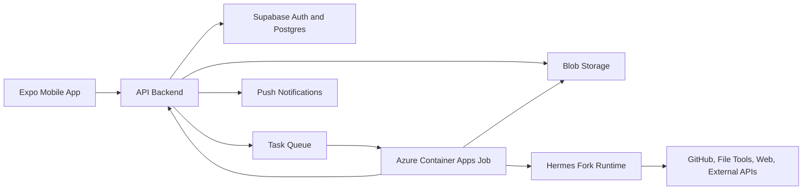

# Raincloud Product Design Spec

Date: 2026-04-30
Status: Foundational design

## Summary

Raincloud is a mobile-first async AI task platform. Users describe work from their phone, Raincloud asks clarifying questions, presents a plan, waits for approval, runs the task on cloud compute, and sends a push notification when the result is ready.

The first version is a hackathon-grade MVP. It should prove a distinct product loop rather than compete as a generic hosted agent. The strongest differentiator is not "agents on Telegram"; that already exists. The differentiator is a phone-native planning, approval, and compute-dispatch layer that turns vague prompts into safe, bounded, priced cloud jobs with real artifacts.

## Problem

AI agents are becoming more capable, but most serious workflows still assume a desktop environment:

- A laptop is available.
- A local machine can stay awake.
- The user can monitor logs or terminals.
- Files, repos, and credentials can be configured manually.
- The user is willing to babysit an agent while it works.

This excludes a massive phone-first audience and weakens the promise of delegation. Even developers who do have laptops often want to delegate tasks while commuting, between classes, at a hackathon, or away from their desk.

## Target Users

Primary users:

- Student builders.
- Hackathon teams.
- Indie developers.
- Startup founders who need small tasks handled while mobile.

Secondary users:

- Phone-first users who need compute-heavy work done without owning a powerful computer.
- Users who need file processing, research packets, data cleanup, or media transformations.

The MVP should speak first to student builders because they understand GitHub, files, AI agents, and hackathon workflows, while still being mobile-heavy enough to feel the pain sharply.

## Positioning

Raincloud is:

- Mobile-first, not desktop-adapted.
- Async, not watch-the-terminal.
- Plan-approved, not uncontrolled autopilot.
- Artifact-driven, not chat-response-only.
- General task capable, but bounded in v1.
- Cloud-backed, but ephemeral by default.

Raincloud is not:

- A hosted OpenClaw or Hermes clone.
- A Telegram bot wrapper.
- A desktop IDE in a mobile shell.
- A persistent cloud VM for every user.
- A general credential vault for all personal accounts in v1.

## Differentiation

Existing hosted agent products already cover many obvious features:

- Chat app control.
- Cloud deployment.
- Persistent agent environments.
- Messaging integrations.
- Basic task automation.

Raincloud should differentiate through a more opinionated workflow:

1. **Preflight planning before compute**
   Raincloud does not immediately launch an expensive worker. It first clarifies the task, decides whether the request is actionable, estimates cost/time, identifies required inputs, and shows the expected output.

2. **Phone-native approval**
   The user can approve, revise, or cancel from a compact mobile plan view. This creates trust and prevents accidental spend.

3. **Compute brokerage**
   Raincloud chooses between cloud containers, external APIs, and deterministic pipelines based on the task. The user does not need to know whether the job uses FFmpeg, an audio generation API, a code agent, a research tool, or a fine-tuning provider.

4. **Real artifacts**
   The result is a PR, file, report, audio sample, processed video, or cleaned dataset, not only a chat message.

5. **Bounded async execution**
   The phone can lock. The job continues. Raincloud returns when it has a result, a blocker, or a useful failure report.

## Greptile Lesson

Greptile is useful as a strategic reference because it does not merely "run agents." It owns a specific trust-critical workflow: code review. It builds codebase context, reviews changes against that context, catches bugs, returns inline findings, generates tests/diagrams, and learns team conventions over time.

The lesson for Raincloud is:

- Do not sell agent hosting as the innovation.
- Own the workflow around the agent.
- Add context before action.
- Add validation before trust.
- Create a concrete output surface.
- Make human approval part of the product, not an afterthought.

For Raincloud, that workflow is mobile preflight planning plus approved cloud execution.

## Core User Journey

1. User opens Raincloud on their phone.
2. User describes a task in natural language.
3. User attaches a file, link, repo, or reference if needed.
4. Raincloud classifies the task into a hidden lane or recipe.
5. Raincloud asks clarifying questions if the task lacks required information.
6. Raincloud produces a plan:
   - Goal.
   - Assumptions.
   - Required inputs.
   - Permissions.
   - Execution steps.
   - Expected outputs.
   - Runtime and credit estimate.
   - Limits and risks.
7. User approves or revises the plan.
8. Raincloud enqueues a cloud job only after approval.
9. The worker runs in an ephemeral sandbox.
10. Raincloud sends progress milestones when useful.
11. User receives a push notification when the job completes or needs input.
12. User opens the result and reviews/downloads/approves the output.

## Product Surface

The first mobile app should be built around four screens:

1. **Task Composer**
   A prompt box, attachment controls, repo/file/link selectors, and lightweight examples. The composer should feel like sending a task to a teammate, not filling a form.

2. **Clarification Thread**
   Compact questions when Raincloud needs missing information. Questions should be specific and limited. Example: "Which voice style should I use for the audiobook sample?"

3. **Plan Review**
   A pre-run plan with expected outputs, estimated credits, runtime, file limits, permissions, and an explicit "Approve & Run" action.

4. **Run Detail and Result**
   Shows status, milestones, blockers, compact logs, output artifacts, PR links, reports, and cost summary.

The app should avoid showing a live terminal by default. A live terminal undermines the core promise of fire-and-forget delegation.

## MVP Task Lanes

### Code PR

User connects GitHub, selects a repo, describes a change, approves a plan, and receives a branch/PR. Raincloud returns:

- PR link.
- Summary of changes.
- Files touched.
- Test or CI status when available.
- Any unresolved risks or follow-up suggestions.

### CSV Cleanup And Analysis

User uploads a messy CSV and describes the desired cleanup. Raincloud returns:

- Cleaned CSV.
- Data validation report.
- Summary of transformations.
- Optional charts or quick analysis.

Example prompt:

> Clean this CSV, dedupe people, normalize phone numbers and dates, detect invalid rows, and give me a summary of what changed.

### Video Processing

User uploads a short video and describes a transformation. Raincloud returns:

- Processed video artifact.
- Captions or transcript when requested.
- Compression/format details.
- Failure explanation if the video exceeds caps.

Example prompt:

> Compress this for WhatsApp, keep it under 25 MB, and extract captions.

### Audio And Audiobook Generation

User uploads text or a short PDF excerpt and describes voice preferences. Raincloud returns:

- Audio sample.
- Transcript or chapter metadata.
- Voice settings summary.
- Credit usage.

Example prompt:

> Turn this chapter excerpt into a calm audiobook sample with a warm narrator voice.

### Deep Research Packet

User asks for a recommendation or research answer that needs multiple sources. Raincloud returns:

- Mobile-readable brief.
- Cited sources.
- Recommendation.
- Exportable Markdown or PDF.

Example prompt:

> Research the best state management library for a small React Native hackathon app and recommend one.

## Plan Mode

Plan Mode is required before every v1 cloud execution.

Plan Mode goals:

- Prevent accidental spend.
- Catch ambiguous prompts.
- Gather missing files, repos, or preferences.
- Show the user what will happen.
- Give the user a chance to revise scope.
- Keep the expensive worker idle until the task is ready.

Plan Mode may use lightweight backend logic and model calls. It must not launch the cloud worker, clone repos, run heavy processing, or call expensive external APIs before user approval.

### Plan Review Contents

Each plan should include:

- Task title.
- Clarified goal.
- Selected task lane or recipe.
- Inputs Raincloud will use.
- Permissions required.
- Steps Raincloud will execute.
- Expected outputs.
- Estimated runtime.
- Estimated credits or cost range.
- Hard limits.
- Assumptions.
- Risks or likely failure points.
- Approval state.

### Clarifying Questions

Raincloud should ask clarifying questions only when the answer changes execution. Good questions include:

- "Which repository should I modify?"
- "Should the output be MP3 or WAV?"
- "What is the maximum file size for the compressed video?"
- "Should invalid CSV rows be removed or separated into a rejected rows file?"
- "Do you want a concise recommendation or a detailed report?"

Raincloud should not ask questions that can be inferred safely from the task, repo, file type, or defaults.

## Architecture

The MVP architecture:

### Components

- **Expo app**: mobile UX, auth session, task composer, plan review, approvals, status, downloads, and push handling.
- **API backend**: task lifecycle, planning orchestration, queueing, permissions, credit accounting, notifications, and worker coordination.
- **Supabase Auth/Postgres**: user accounts, task records, GitHub identity where appropriate, row-level authorization patterns.
- **Blob storage**: uploaded files and generated artifacts.
- **Task queue**: decouples approved tasks from worker execution.
- **Azure Container Apps Jobs**: finite cloud jobs for sandboxed task execution.
- **Hermes fork runtime**: agent substrate inside the worker.
- **External APIs**: optional providers for audio generation, video services, fine-tuning, web search, and document processing when more cost-effective than direct infrastructure.

## Task Lifecycle

Task states:

- `draft`: user has started a prompt but not submitted.
- `clarifying`: Raincloud needs more information.
- `plan_review`: plan is ready for approval.
- `queued`: user approved and job is waiting for execution.
- `planning`: worker is preparing execution details.
- `running`: worker is executing.
- `needs_input`: worker is blocked and needs user input or approval.
- `succeeded`: final output is ready.
- `failed`: execution ended with a useful failure report.
- `canceled`: user or system canceled the task.

The worker must receive only an approved plan, not an unreviewed prompt.

## Data Model

Conceptual records:

- User.
- Task.
- Task attachment.
- Task plan.
- Clarifying question.
- Approval event.
- Worker run.
- Milestone.
- Artifact.
- Usage record.

The MVP does not need a complex schema yet, but every task must preserve the approved plan used by the worker for auditability.

## API Surface

User-facing operations:

- Create draft task.
- Upload attachment.
- Connect GitHub or select repository.
- Submit task for planning.
- Answer clarifying question.
- Fetch proposed plan.
- Revise task instructions.
- Approve plan.
- Cancel task.
- List tasks.
- View task detail.
- Download artifact.
- Open PR or external result link.

Worker operations:

- Load approved task payload.
- Claim or start run.
- Write milestone.
- Request input.
- Upload artifact.
- Report usage.
- Mark success.
- Mark failure.

## Trust, Privacy, And Cost

Defaults:

- Ephemeral workers only.
- No persistent memory in v1.
- No arbitrary credential vault in v1.
- No Gmail, Calendar, Drive, or broad personal account actions in v1.
- Short artifact retention by default.
- Compact logs with sensitive value redaction.
- Narrow GitHub permissions.
- Per-task runtime and spend caps.

Recommended initial caps:

- Small demo video clips only.
- Small audiobook samples only.
- CSV files below a documented row and size limit.
- Code tasks limited to selected repos.
- No full production-scale book conversion in v1.
- No unattended external API spend beyond the approved cap.

## Failure Handling

Failed tasks should still produce a result page. A useful failure page includes:

- What Raincloud attempted.
- Where it failed.
- Whether user input can fix it.
- Whether partial artifacts exist.
- Actual credits spent.
- Suggested next action.

## Hackathon Demo Strategy

The hackathon demo should avoid trying to prove "any task." It should prove one memorable consumer compute workflow plus one developer workflow.

Recommended demo:

1. **Consumer hero demo**
   User uploads a short chapter excerpt and asks for an audiobook sample. Raincloud asks voice/format questions, shows a cost/time plan, waits for approval, runs the worker, and returns audio.

2. **Developer demo**
   User connects a GitHub repo and asks for a small change. Raincloud clarifies scope, shows plan, waits for approval, runs the agent, and returns a PR.

3. **Data demo if time allows**
   User uploads messy CSV, approves cleanup plan, and receives cleaned CSV plus report.

The pitch should emphasize:

- The phone is the control plane.
- Planning happens before spend.
- Jobs run after approval.
- Outputs are artifacts.
- Cloud compute and APIs are brokered invisibly.

## Acceptance Tests

### Vague Task Flow

Given a vague prompt such as "make this better," Raincloud asks clarifying questions and does not enqueue a worker until the user answers and approves a plan.

### Plan Approval Flow

Given a CSV cleanup task, Raincloud shows expected outputs, limits, credit estimate, and runtime estimate. The worker starts only after the user taps "Approve & Run."

### Plan Revision Flow

Given a proposed plan, the user can revise instructions before approval. The worker receives the revised approved plan only.

### Code PR Flow

Given a GitHub-connected task, Raincloud opens a branch or PR, then returns a PR link, summary, file changes, and check status where available.

### Heavy Compute Flow

Given a short video, audio, or book excerpt task, Raincloud shows strict caps before approval, runs the job, and returns a processed artifact.

### Failure Flow

Given a task that exceeds limits or fails during execution, Raincloud returns a clear failure page with attempts, reason, partial artifacts, and spend.

## Non-Goals For V1

- Full production-scale media processing.
- Persistent personal agents.
- Always-on cloud machines.
- Live terminal as the default interaction model.
- Broad personal account automation.
- Full enterprise compliance.
- Marketplace of agent skills.
- Multi-cloud portability.
- Native iOS/Android code before the Expo MVP validates demand.

## Explicit Assumptions

- The MVP targets a hackathon proof first.
- Azure is the first cloud target.
- Hermes is the first runtime substrate.
- External APIs are acceptable when they are cheaper or better than direct cloud compute.
- The first UX is an Expo mobile app.
- Every v1 cloud job requires user approval after plan review.
- The strongest demo is one heavy consumer task plus one developer PR task.
